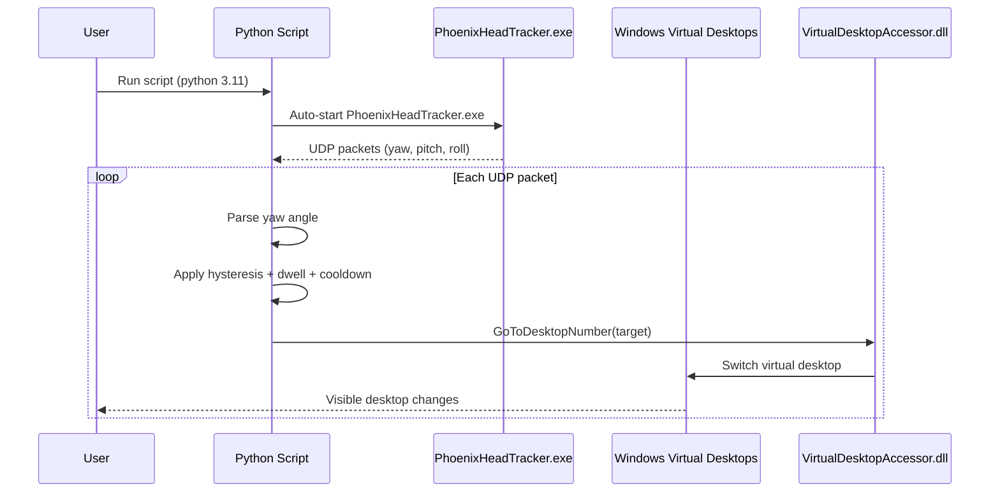

# XREAL-3D-Workspace-Workaround-Virtual-Desktops

A **Nebula / VertoXR alternative** for Windows — *not* a true XR 3D space.  
This project prioritizes **stability, performance, and visual fidelity** over full 3D environments.

It keeps the display as a **native HDMI output (100% original resolution, no scaling)** and uses **head yaw + Windows Virtual Desktops** to simulate a multi-monitor setup with **lower CPU/GPU usage and zero render-quality loss**.

> ✅ Unlike some 3D workspace environments, this approach preserves **native HDMI resolution and sharpness**, avoiding the slight clarity loss that can occur in rendered XR desktops.

---

## What is this?

XREAL glasses on Windows behave like a normal external monitor (HDMI).  
This project turns that single screen into a **multi-screen illusion**:

- Create **N Windows Virtual Desktops** (commonly 3: Left / Center / Right)
- Place apps across desktops
- Run **one Python script** (no extra Python packages required)
- The script **automatically starts the head tracker**
- Head yaw controls desktop switching

Result: a “3D workspace” feeling using **Windows’ own desktops**  
→ lightweight, stable, pixel-perfect.

---

## Why this approach? (Stability + Performance + Image Quality)

Full 3D workspaces can:
- consume more CPU/GPU,
- introduce rendering latency,
- slightly reduce image sharpness due to reprojection or scaling,
- be more sensitive to tracking glitches and driver issues.

This project:
- uses **native HDMI resolution** (no reprojection, no rescaling),
- does **no 3D rendering at all**,
- keeps text and UI **pixel-perfect**,
- offloads “multi-monitor behavior” to **Windows Virtual Desktops**.

---

## Features

- ✅ Head-yaw driven switching (Left / Center / Right)
- ✅ **Native HDMI resolution** (no visual degradation)
- ✅ Static display = higher stability
- ✅ Hysteresis, cooldown **and dwell confirmation**
- ✅ **Automatically starts PhoenixHeadTracker.exe**
- ✅ No external Python dependencies (standard library only)
- ✅ Supports **N desktops** (most users start with 3)

---

## How it works (Sequence Diagram)



---

## Requirements

- Windows 10/11
- Python **3.11+**
- XREAL glasses connected as a display (HDMI / adapter)
- Windows Virtual Desktops enabled
- PhoenixHeadTracker (included)

---

## Project files

```
.
├─ AirAPI_Windows.dll
├─ hidapi.dll
├─ PhoenixHeadTracker.exe
├─ VirtualDesktopAccessor.dll
└─ main_udp_yaw_desktop_switcher.py
```

---

## How to run

1. Create virtual desktops (`Win + Ctrl + D`)
2. Organize your apps (Left / Center / Right)
3. Run:

```bash
python main_udp_yaw_desktop_switcher.py
```

The script automatically launches the tracker.

---

## Configuration

All configuration is done inside the Python script.

| Setting | Meaning | Typical |
|---|---|---|
| `PORT` | UDP port | 4242 |
| `ANGLE` | Yaw threshold | 25–40 |
| `HYST_DEG` | Exit hysteresis | 4–10 |
| `DWELL_CONFIRM_MS` | Time inside zone | 300–700 |
| `COOLDOWN_MS` | Min time between switches | 250–800 |
| `CENTER_DESKTOP` | Central desktop | 2 |
| `AUTO_START_PHOENIX` | Auto-launch tracker | True |

---

## Third-party components / Credits

- VirtualDesktopAccessor.dll — https://github.com/Ciantic/VirtualDesktopAccessor
- AirAPI_Windows.dll — https://github.com/MSmithDev/AirAPI_Windows
- hidapi.dll — https://github.com/libusb/hidapi
- PhoenixHeadTracker.exe — https://github.com/iVideoGameBoss/PhoenixHeadTracker

---

## Disclaimer

This project is **not affiliated** with XREAL, Nebula, VertoXR, or Microsoft.

---

## License

GNU GPL v3.0 — see `LICENSE`.

Third-party binaries remain under their respective licenses.
